# My Assignment Repository

This repository showcases my assignment work, including my Git certificate, various Linux command screenshots, and SDLC process documentation. All key visuals are presented below for immediate review.

---

## All Assignment Visuals

### SDLC Process Screenshots

### Git Certificate
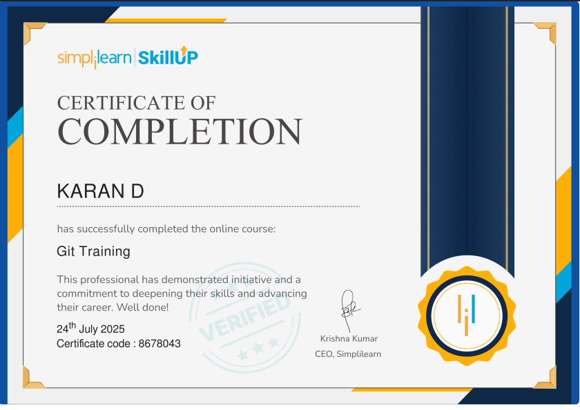

### C Programming Certificates
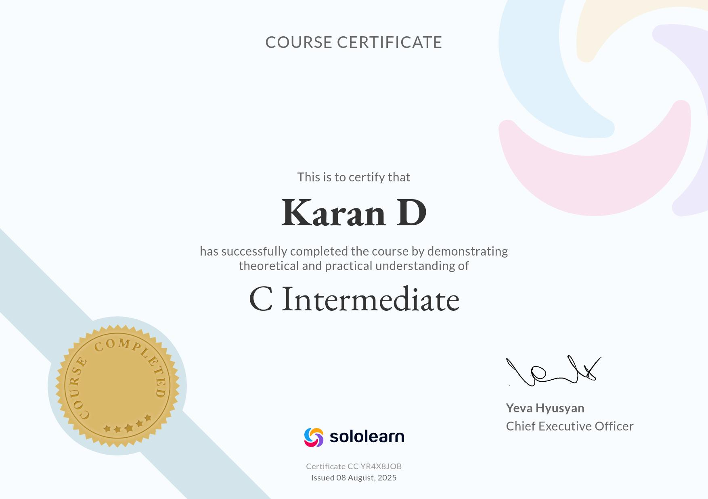
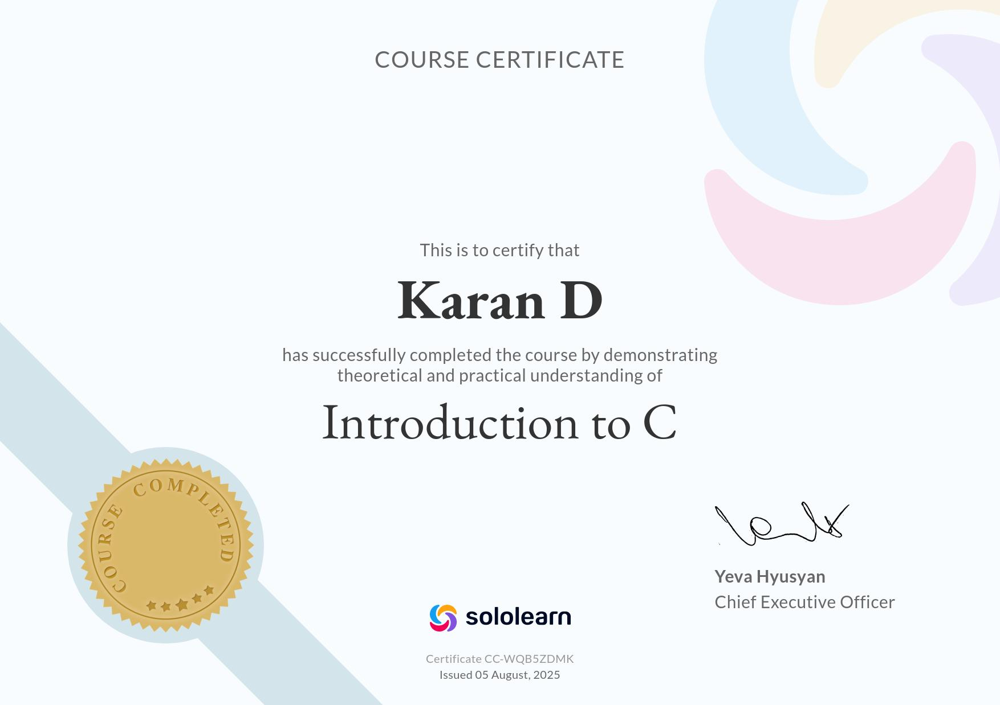

### C Programming Assignments (Weekly Exercises)
*   **Week 1:**
    *   [Counting Sort 1.c](C%20Programming/WEEK1/Counting%20Sort%201.c)
    *   [Diagonal Difference.c](C%20Programming/WEEK1/Diagonal%20Difference.c)
    *   [Flipping bits.c](C%20Programming/WEEK1/Flipping%20bits.c)
    *   [Lonely Integer.c](C%20Programming/WEEK1/Lonely%20Integer.c)
    *   [Mini-Max Sum.c](C%20Programming/WEEK1/Mini-Max%20Sum.c)
    *   [Plus Minus.c](C%20Programming/WEEK1/Plus%20Minus.c)
    *   [Sparse Arrays.c](C%20Programming/WEEK1/Sparse%20Arrays.c)
    *   [Time Conversion.c](C%20Programming/WEEK1/Time%20Conversion.c)
*   **Week 2:**
    *   (No files yet)
*   **Week 3:**
    *   (No files yet)
*   **Week 4:**
    *   (No files yet)

### Linux Command Screenshots
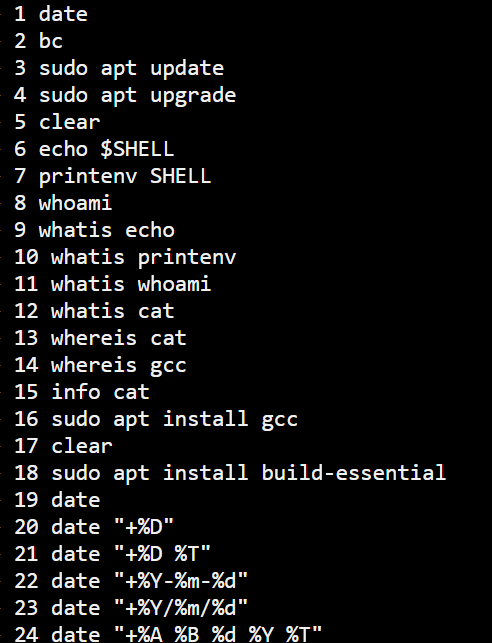
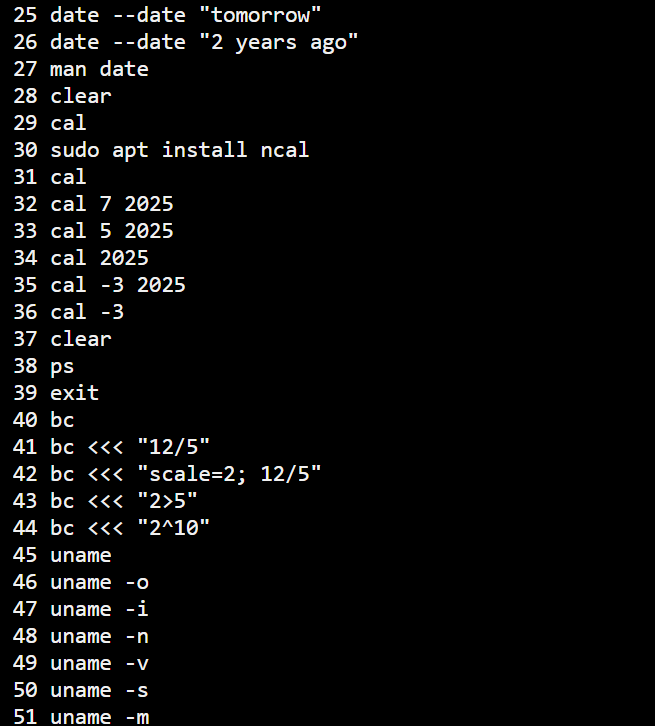
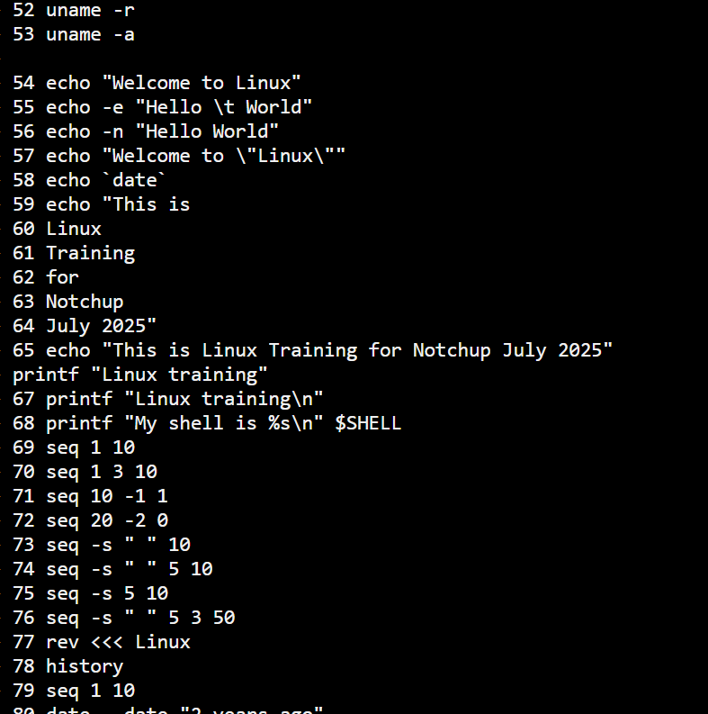
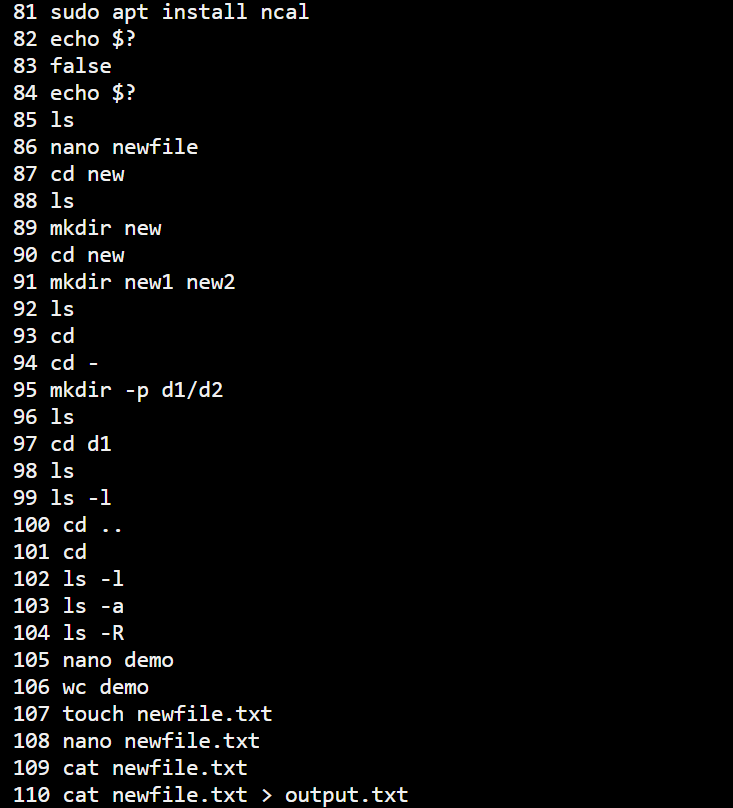
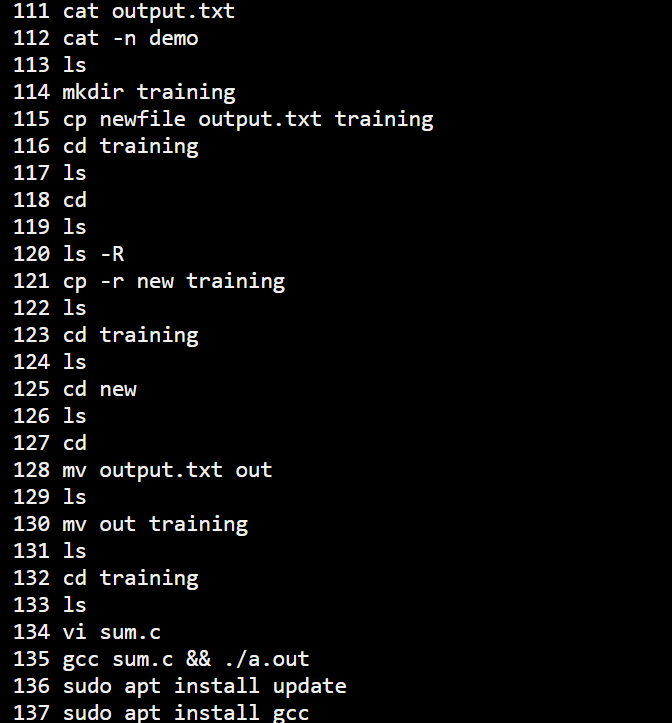
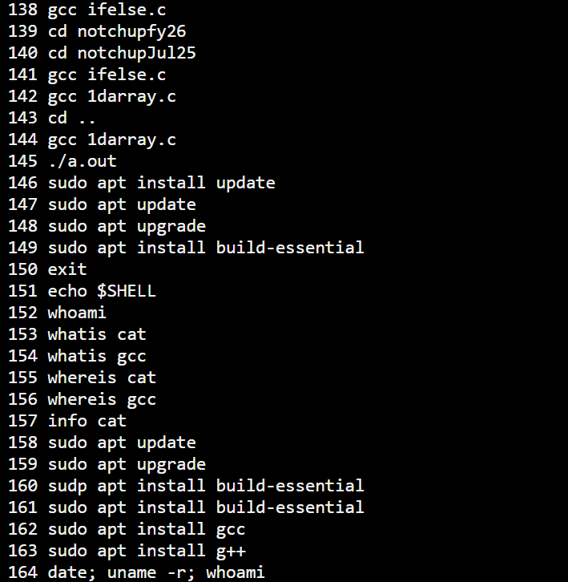
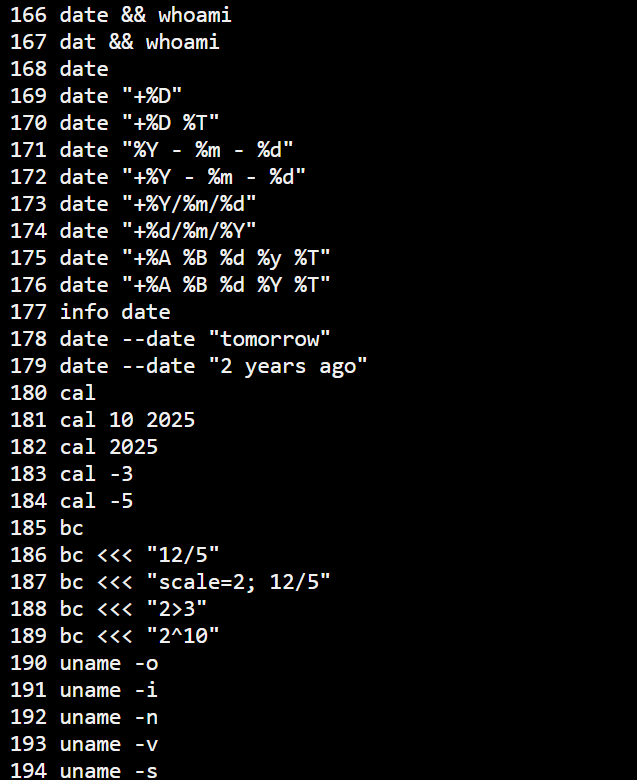
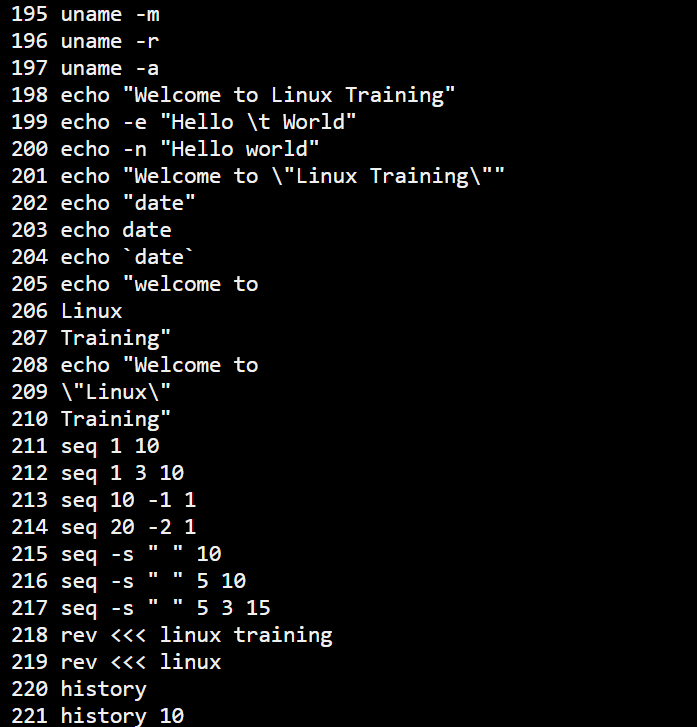
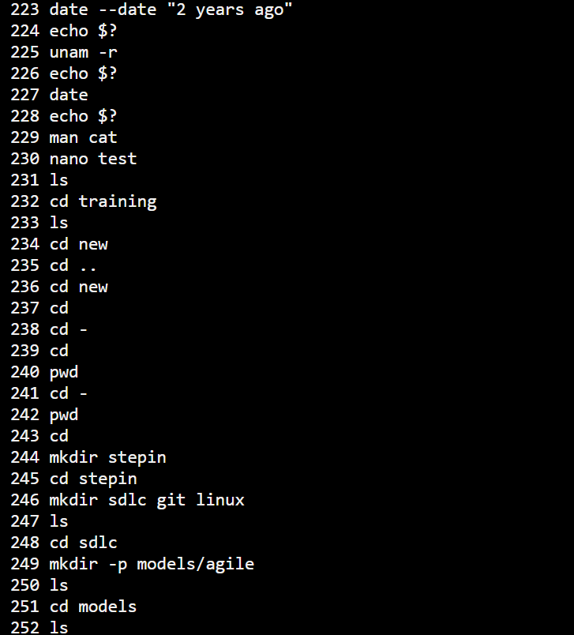

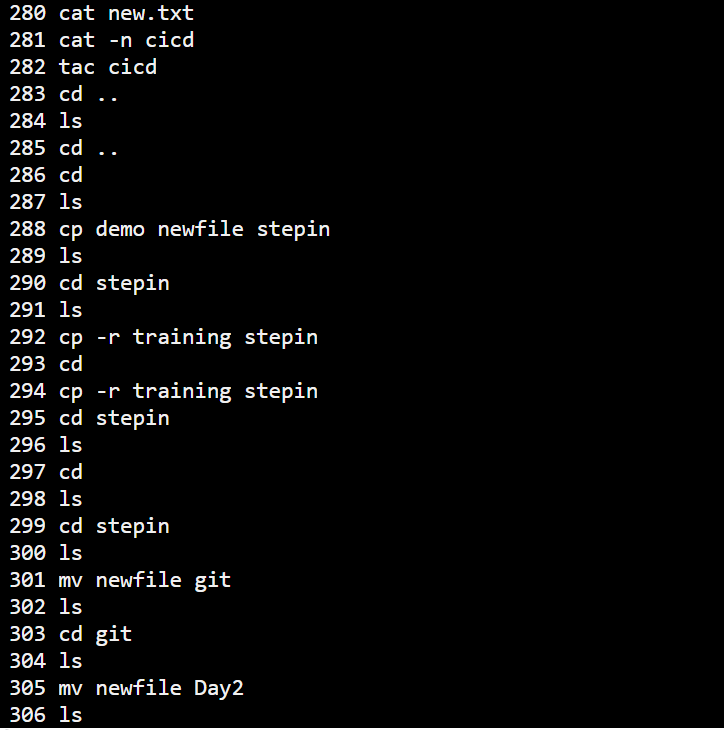
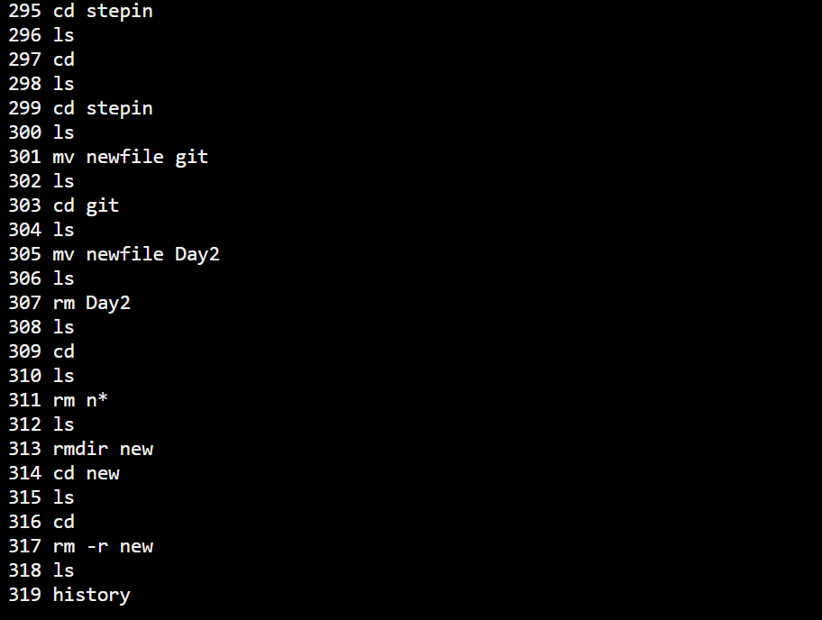
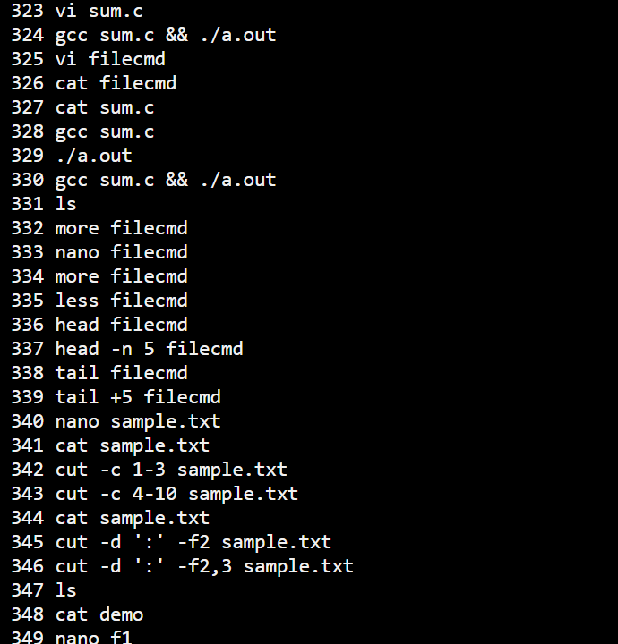
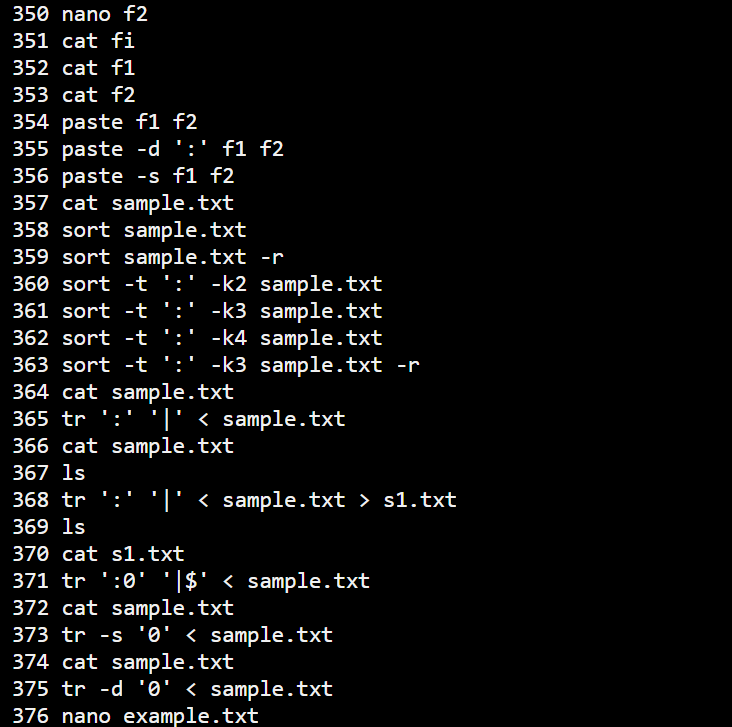
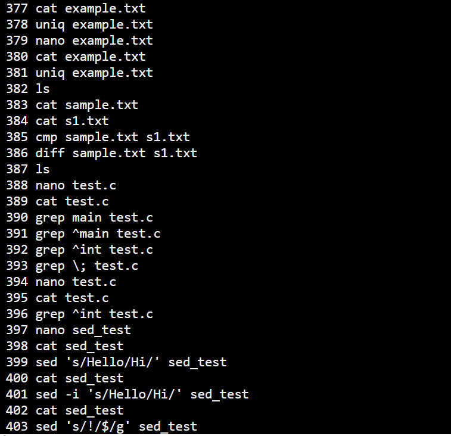
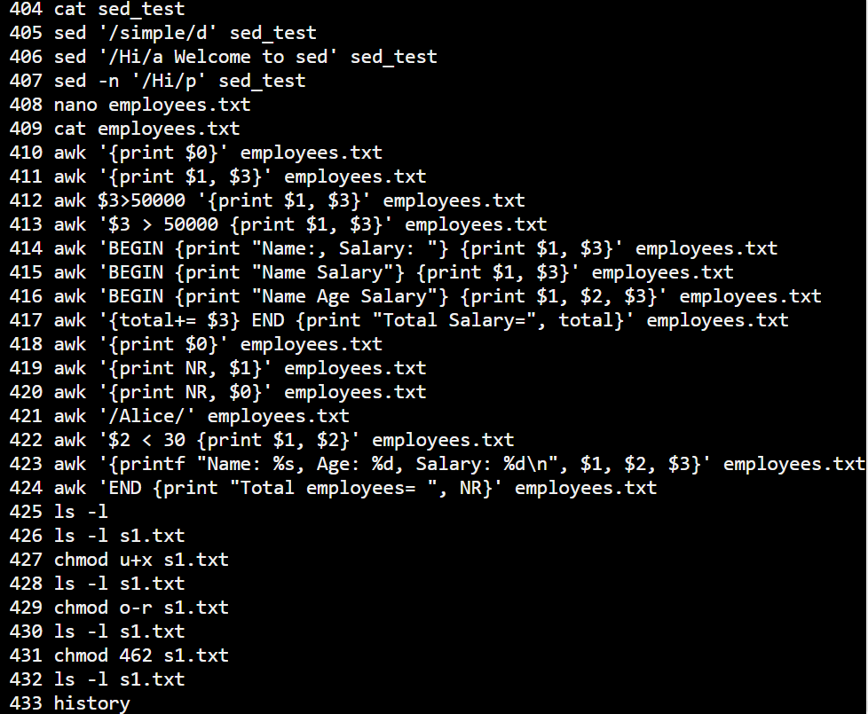

---

## Repository Details

### Folder Structure:
- `GIT/`: Contains my Git certificate.
- `SOLOLEARN/`: Contains SoloLearn C programming certificates (PNG).
- `C Programming/`: Contains weekly C programming assignment folders (e.g., `WEEK1`, `WEEK2`).
- `SDLC/`: Contains my SDLC related documents and images.
- `Linux/`: Contains screenshots of Linux commands and terminal sessions.