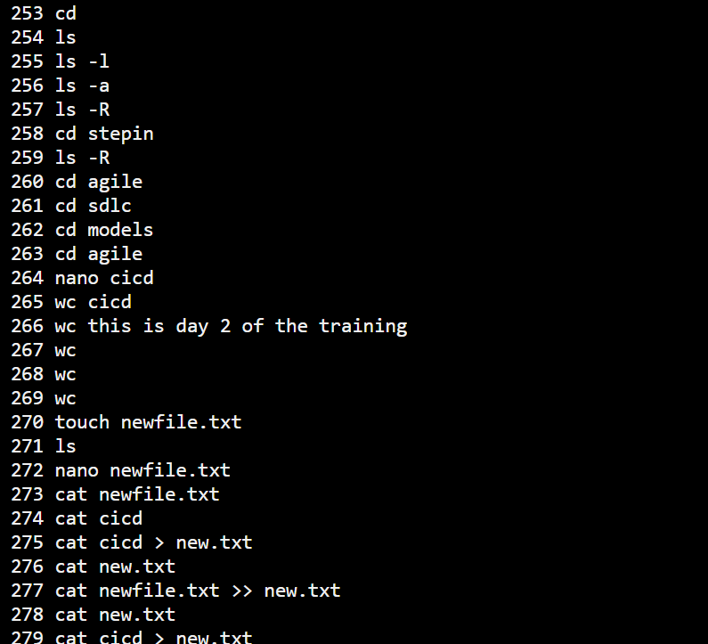
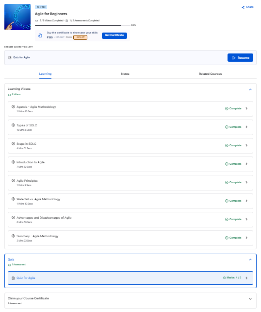
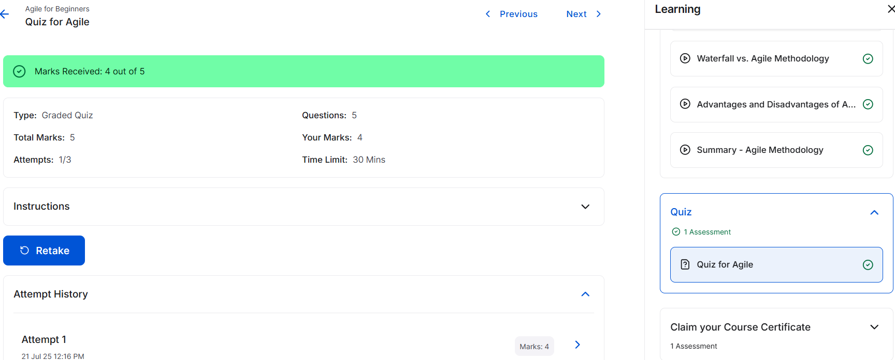

# My Assignment Repository

This repository contains my assignment files, including my Git certificate, SDLC documents, and Linux command screenshots.

## Folder Structure:
- `GIT/`: Contains my Git certificate (PDF and PNG).
- `SDLC/`: Contains my SDLC related documents and images.
- `Linux/`: Contains screenshots of Linux commands and terminal sessions.

---

## Git Certificate

Here is my Git certificate:

---

## Linux Command Screenshots

Below are screenshots illustrating various Linux commands and terminal interactions:

### Command Screenshots:
- 
- 
- 
- 
- 
- 
- 
- 
- 
- 
- 
- 
- 
- 
- 
- 

---

## SDLC Image Displays

Here are the images related to the SDLC process:

### Completed SDLC Process Screenshot

### Quiz SDLC Screenshot
